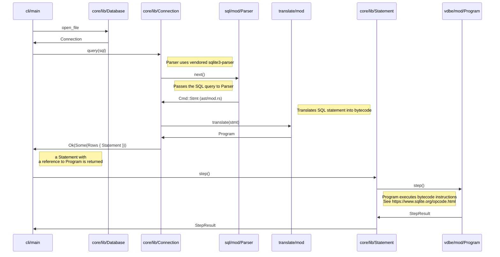

<p align="center">
  Limbo is a work-in-progress, in-process OLTP database management system, compatible with SQLite.
</p>

---

## Features

* In-process OLTP database engine library
* Asynchronous I/O support on Linux with `io_uring`
* SQLite compatibility ([status](COMPAT.md))
  * SQL dialect support
  * File format support
  * SQLite C API
* JavaScript/WebAssembly bindings (_wip_)
* Support for Linux, macOS, and Windows

## Getting Started

### CLI

Install `limbo` with:

```shell 
curl --proto '=https' --tlsv1.2 -LsSf \
  https://github.com/penberg/limbo/releases/latest/download/limbo-installer.sh | sh
```

Then use the SQL shell to create and query a database:

```console
select * from sqlite_schema;
CREATE TABLE users (id INT PRIMARY KEY, username TEXT);
INSERT INTO users VALUES (1, 'alice');
SELECT * FROM users where id =1;
1|alice
```

## FAQ

### How is Limbo different from libSQL?

Limbo is a research project to build a SQLite compatible in-process database in Rust with native async support. The libSQL project, on the other hand, is an open source, open contribution fork of SQLite, with focus on production features such as replication, backups, encryption, and so on. There is no hard dependency between the two projects. Of course, if Limbo becomes widely successful, we might consider merging with libSQL, but that is something that will be decided in the future.

## Publications

* Pekka Enberg, Sasu Tarkoma, Jon Crowcroft Ashwin Rao (2024). Serverless Runtime / Database Co-Design With Asynchronous I/O. In _EdgeSys ‘24_. [[PDF]](https://penberg.org/papers/penberg-edgesys24.pdf)
* Pekka Enberg, Sasu Tarkoma, and Ashwin Rao (2023). Towards Database and Serverless Runtime Co-Design. In _CoNEXT-SW ’23_. [[PDF](https://penberg.org/papers/penberg-conext-sw-23.pdf)] [[Slides](https://penberg.org/papers/penberg-conext-sw-23-slides.pdf)]

## Contributing

We'd love to have you contribute to Limbo! Check out the [contribution guide] to get started.

## License

This project is licensed under the [MIT license].

### Contribution
[contribution guide]: https://github.com/penberg/limbo/blob/main/CONTRIBUTING.md

The following sequence diagram shows the typical flow of a query from the CLI to the [VDBE](https://www.sqlite.org/opcode.html).



